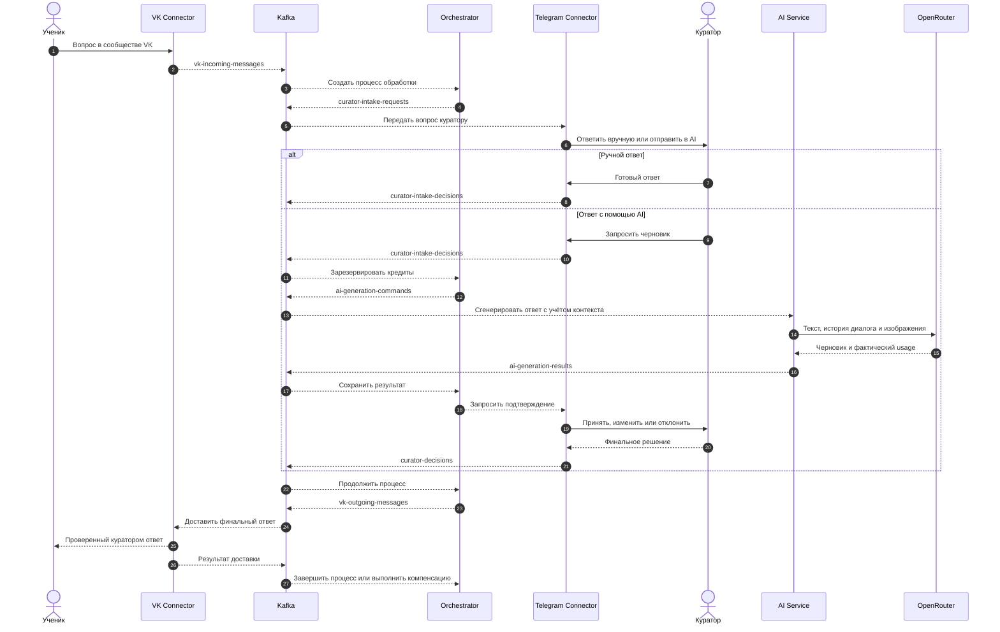

# Curator AI Assistant

Событийная платформа, которая помогает кураторам отвечать на вопросы учеников
из VK, не отдавая нейросети право говорить с человеком без проверки.

Ученик продолжает писать в привычном сообществе VK. Куратор работает через
Telegram: может ответить сам или запросить черновик у AI, а затем принять,
отредактировать либо отклонить его. Платформа берёт на себя маршрутизацию,
состояние процесса, биллинг, повторные попытки и доставку ответа.

> **Текущий профиль развёртывания:** production-oriented конфигурация для
> пилота на одном сервере. Сервисы спроектированы с возможностью независимого
> масштабирования, но настоящий HA-контур потребует кластерных Kafka,
> PostgreSQL и Redis, а также внешнего хранилища секретов.

## Зачем это нужно

Обычный чат-бот отвечает быстро, но не может отвечать за качество учебной
коммуникации. Полностью ручная поддержка сохраняет качество, но заставляет
кураторов тратить время на повторяющиеся вопросы и постоянное переключение
контекста.

Curator AI Assistant занимает место между этими крайностями:

- финальное решение всегда остаётся за куратором;
- для каждого вопроса можно выбрать ручной ответ или генерацию через AI;
- AI-черновик можно принять, изменить или отклонить прямо в Telegram;
- ручные ответы проходят через тот же надёжный контур доставки;
- стоимость провайдера переводится в кредиты и сохраняется для аудита;
- ошибка генерации или доставки не должна незаметно списывать баланс;
- каждый долгий процесс имеет состояние в БД и может быть восстановлен.

## Как проходит запрос



HTTP webhook отвечает быстро после проверки и сохранения события. Всё, что
может выполняться долго или временно быть недоступным, вынесено в асинхронный
контур: действия куратора, генерация AI, биллинг и отправка сообщения в VK.

## Сервисы

| Сервис | Зона ответственности | Порт |
| --- | --- | ---: |
| `vk-connector-service` | VK Callback API, данные сообществ, дедупликация входящих событий, кеш профилей, доставка и ретраи | `8081` |
| `orchestrator-service` | Машина состояний, компенсации, watchdog, transactional outbox и обработка dead letter | `8082` |
| `ai-service` | Интеграция с OpenRouter, история диалога, журнал генераций, учёт токенов и стоимости | `8083` |
| `tg-connector-service` | Telegram-боты куратора и администратора, онбординг, подключение VK, модерация, биллинг и rate limit | `8084` |
| `shared-libs` | Общая политика Kafka retry, correlation context, расчёт кредитов и AES-GCM шифрование | библиотека |

Каждый прикладной сервис владеет своими данными и Flyway-миграциями. Сервисы
обмениваются версионируемыми JSON-событиями через Kafka и не читают таблицы
друг друга.

## Архитектурные решения

### Асинхронность по умолчанию

Kafka отделяет скорость приёма сообщений от скорости их обработки. Всплеск
запросов на VK webhook превращается в очередь устойчивых событий, а не в такой
же всплеск вызовов OpenRouter и Telegram. Consumer groups позволяют
обрабатывать партиции параллельно, а каждый сервис можно масштабировать и
настраивать независимо.

### At-least-once без двойных действий

Kafka может доставить событие повторно, поэтому идемпотентность здесь является
частью бизнес-логики. Используются стабильные `requestId`, уникальные ключи
дедупликации, журналы генерации и доставки, проверки текущего состояния и
блокировки строк в PostgreSQL. Повтор события продолжает уже начатую операцию,
а не создаёт повторное списание или сообщение.

### Transactional outbox

Критичное изменение состояния и предназначенное для Kafka событие сохраняются
в одной транзакции PostgreSQL. Фоновые publisher-процессы доставляют записи из
outbox с ограниченным exponential backoff. Это закрывает окно отказа, в котором
транзакция БД уже завершилась, а событие ещё не попало в брокер.

### Ошибки являются частью сценария

Временные ошибки Kafka повторяются, после чего сообщение направляется в
`.DLT`. Оркестратор сохраняет dead letter в PostgreSQL, повторяет восстановимые
операции и отправляет исчерпавшие лимит записи в parking topic. Workflow
watchdog находит зависшие состояния после таймаутов или перезапусков и либо
возобновляет нужный шаг, либо уведомляет куратора.

При ошибке AI резерв кредитов освобождается. Отклонённый черновик не
оплачивается. Если оплаченный ответ не удалось доставить в VK, запускается
идемпотентный возврат, а его результат фиксируется в журнале.

### Human in the loop

AI не отправляет сгенерированный текст ученику напрямую. Куратор видит в
Telegram исходный вопрос и предложенный ответ, после чего принимает решение.
Можно полностью обойти AI, изменить черновик, отклонить его, а также повторить
или отменить неудачную ручную доставку.

## Подготовка к высокой нагрузке

Архитектура рассчитана на сценарий, в котором внешние API работают медленнее и
менее стабильно, чем приходят новые сообщения:

- Kafka partitions распределяют работу между экземплярами и создают
  естественный backpressure;
- приём webhook, AI, модерация, биллинг и доставка масштабируются как отдельные
  этапы;
- PostgreSQL outbox сохраняет принятую работу даже во время недоступности
  брокера;
- token bucket в Redis координирует лимиты Telegram API между экземплярами;
- Caffeine кеширует профили VK и сокращает количество внешних запросов;
- размеры batch, таймауты, ретраи и connection pool ограничены конфигурацией;
- `requestId` проходит через Kafka headers и MDC, связывая логи разных
  сервисов;
- Actuator readiness probes и Prometheus metrics готовы для мониторинга и
  оркестрации.

Проект намеренно не заявляет выдуманное количество RPS. Реальная пропускная
способность зависит от числа партиций, ресурсов PostgreSQL, квот провайдеров,
доли сообщений с изображениями и задержки AI. Перед масштабным запуском эти
параметры должны быть зафиксированы в профиле нагрузки и проверены
воспроизводимыми load- и soak-тестами.

## Технологический стек

| Область | Технологии |
| --- | --- |
| Runtime | Java 21, Spring Boot 3.5, Gradle 8 |
| Messaging | Apache Kafka 4, Spring Kafka |
| Хранение данных | PostgreSQL 17, Spring Data JPA, Hibernate, Flyway |
| Координация и кеш | Redis 7, Lettuce, Bucket4j, Caffeine |
| Интеграции | VK Callback/API, Telegram Bots API, Telegram Stars, OpenRouter |
| Эксплуатация | Docker multi-stage build, Docker Compose, Caddy, Prometheus metrics |
| Тестирование | JUnit 5, Mockito, Spring Boot Test, Spring Kafka Test |
| Безопасность | AES-256-GCM, автоматический TLS, non-root read-only контейнеры |

## Надёжность и безопасность

- VK-токены и callback secrets шифруются в БД с помощью AES-256-GCM.
- Production reverse proxy публикует только `/vk/webhook`; Actuator остаётся во
  внутренней Docker-сети.
- Caddy автоматически получает и обновляет TLS-сертификаты.
- Приложения работают от непривилегированного пользователя с read-only
  filesystem и `no-new-privileges`.
- Flyway проверяет миграции при старте, destructive-команда `clean` отключена.
- В production у сервисов разделены пользователи, пароли и базы PostgreSQL.
- Биллинг хранит usage, стоимость провайдера, курс, списанные кредиты, резервы,
  освобождения и возвраты.
- Вызовы Telegram защищены распределённым rate limiter и ограниченными
  повторами.
- Для каждого сервиса настроены health checks, Prometheus metrics и ротация
  Docker-логов.

Секреты должны находиться в локальном env-файле или внешнем secret store.
Файлы `.env` и `.env.*` игнорируются Git; в репозиторий входят только
обезличенные примеры конфигурации.

## Структура репозитория

```text
.
|-- ai-service/                 OpenRouter и контекст диалога
|-- orchestrator-service/       Машина состояний и восстановление
|-- tg-connector-service/       Telegram-боты, модерация и биллинг
|-- vk-connector-service/       Приём событий VK, настройка и доставка
|-- shared-libs/                Общие Kafka, logging, pricing и crypto-компоненты
|-- infra/
|   |-- caddy/                  Публичная TLS-точка входа
|   `-- postgres/               Инициализация баз данных
|-- scripts/                    Тесты, preflight и резервные копии
|-- compose.prod.yml            Усиленная single-host production-конфигурация
|-- docker-compose.yml          Локальное окружение
`-- docs/                       Runbook и архитектурный backlog
```

## Локальный запуск

Понадобятся:

- JDK 21;
- Docker Engine и Docker Compose v2;
- данные Telegram-бота;
- API key для OpenRouter;
- сообщество VK с доступом к Callback API.

Создайте локальную конфигурацию:

```bash
cp .env.example .env
```

Заполните обязательные значения и запустите окружение:

```bash
docker compose up -d --build
```

Полный набор тестов:

```bash
./gradlew test
```

На Windows:

```bat
gradlew.bat test
```

Health checks и метрики каждого сервиса доступны во внутреннем контуре:

```text
/actuator/health
/actuator/health/readiness
/actuator/prometheus
```

## Production deployment

Текущая production-конфигурация рассчитана на Linux-сервер с настроенным DNS,
открытыми портами `80/tcp`, `443/tcp` и `443/udp`, а также минимум 4 CPU, 8 GB
RAM и 40 GB постоянного диска для начальной нагрузки.

```bash
cp .env.prod.example .env.prod
chmod 600 .env.prod
./scripts/preflight-prod.sh
docker compose --env-file .env.prod -f compose.prod.yml up -d --build
```

`preflight-prod.sh` до начала развёртывания проверяет placeholders, повторно
использованные пароли БД, формат ключа шифрования, валидность Compose и
доступность Docker daemon.

Обновление, диагностика, резервное копирование и обязательные проверки перед
запуском описаны в [production runbook](docs/production-runbook.md).

## Текущие границы

В репозитории есть основа для серьёзного single-node пилота: устойчивые
workflow, миграции, ретраи, компенсации, security hardening, метрики, backup и
unit-тесты критичных доменных сценариев.

Проект не выдаётся за полностью завершённую enterprise-платформу. Следующие
эксплуатационные этапы:

- интеграционные тесты с Kafka, PostgreSQL, Redis и заглушками провайдеров;
- воспроизводимые load-, soak-, failover-, backup- и restore-тесты;
- CI/CD с dependency, container и secret scanning;
- централизованные логи, dashboards, alerts и формализованные SLO;
- managed secrets и ротация ключей;
- multi-node Kafka, PostgreSQL failover и несколько экземпляров приложений.

Дальнейшие продуктовые и архитектурные задачи собраны в
[architecture backlog](docs/architecture-backlog.md).
